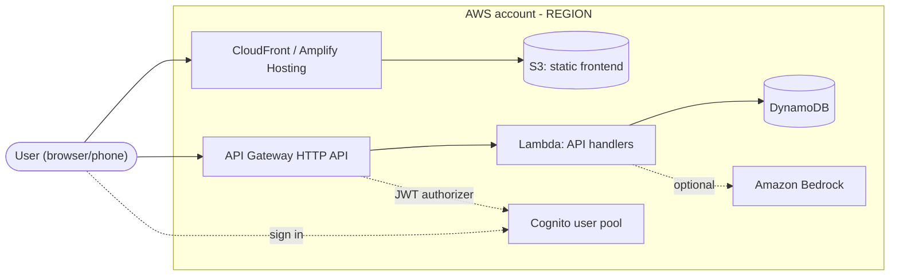

# Architecture Selection

Choose a stack that a 3-person team can take to a working, demo-ready AWS deployment in the time they have. Then write the choice into always-on steering so every later Kiro session follows it.

## When to use

- A new project or repo, with no `.kiro/steering/tech.md` yet or a placeholder one.
- A major new component: adding GenAI, auth, file uploads, real-time updates, a mobile client or a second service.
- The current stack has hit a hard blocker: a service is unavailable in the region, a cost alarm fired, or a teammate left and their skills went with them.

Do not use it for:

- Designing a feature inside a stack that is already chosen. Hand off to **quick-spec**.
- Errors, failing deploys or wrong behaviour. Hand off to **bug-fix**.
- Brainstorming the product idea. Ask only enough about the product to choose the architecture.

## Operating rules

1. **Three-turn target.** Turn 1: ask the batched questions. Turn 2: give the recommendation with the matrix. Turn 3: write the files. If the user already gave the answers, skip turn 1. The team is on Kiro Free (50 credits a month, shared across chat, specs and hooks), so every extra round trip costs.
2. **Never invent requirements.** Use only what the user said. Mark everything else `(assumed)` and list it where the user will see it.
3. **Prefer proven technology.** Prefer managed, serverless, well-documented services the team already knows. The team gets one "innovation token": at most one tool or service on the critical path that nobody on the team has used before.
4. **Record, don't just chat.** A decision that exists only in chat is lost when the session ends. Record it in the ADR, `tech.md` and `structure.md`.
5. **Decide only.** Do not scaffold code, write infrastructure, or run commands that create or change AWS resources here. The exception is a short spike the user explicitly approves (see Phase 4).
6. **Stay accurate.** Do not quote prices, quotas or limits from memory as facts. Write "check current pricing" or "verify in the console", and name the page to check.

## Inputs and outputs

**Inputs:** the user's message, plus whatever already exists in `.kiro/steering/` (`product.md`, `tech.md`, `structure.md`) and `docs/decisions/`.

**Outputs:**

| File | Purpose | Create or update |
|---|---|---|
| `docs/decisions/NNNN-<slug>.md` | ADR: context, options, matrix, decision, diagram, guardrails | Always new. Supersede old ADRs; never rewrite them. |
| `.kiro/steering/tech.md` | Always-on stack rules for the agent | Edit sections in place if the file exists |
| `.kiro/steering/structure.md` | Folder layout, naming, ownership | Edit sections in place if the file exists |
| `.kiro/steering/product.md` | Only if missing: 3-6 lines of facts the user stated | Optional |

Steering files with no frontmatter are included in every interaction by default. If an existing file has frontmatter, keep it. Because `tech.md` and `structure.md` are loaded on every turn, keep each under about 80 lines.

## Phase 0: Read the current state (cheap)

1. List `.kiro/steering/` and `docs/decisions/`. Read only those files. Do not scan the whole codebase.
2. If an accepted ADR already covers this scope, this is a revision. Note its number; the new ADR will supersede it.
3. Note any facts already present, such as team skills in `product.md` or an existing region. Do not ask for them again.

## Phase 1: Gather constraints in ONE message

Send this once, removing any question that is already answered. Defaults in brackets let the user reply "defaults ok".

```text
To pick the stack I need a few facts. Answer in one reply; anything you skip uses the [default].

1. Problem and user: what does it do, and for whom? One sentence.  [required]
2. Demo: which 1-3 actions must work live in front of judges?      [the core flow from Q1]
3. Time: hours until code freeze, and hours each of the 3 of you can give?  [24 h total, ~8 h each]
4. Skills: strongest language/framework per person; has anyone deployed to AWS before?
   [2x React/JavaScript, 1x Python; little AWS experience]
5. AWS account: one shared account, individual accounts, or event-provided? Credits or a hard budget?
   [one shared account; spend nothing beyond Free Tier or credits]
6. Must-haves: login, file/photo upload, real-time updates, GenAI/chat, maps, notifications, mobile app?
   [login + one GenAI feature]
7. Data: any personal data? Must data stay in Malaysia?             [emails only; no residency rule]
8. Event rules: required services, judging criteria, anything banned?  [none known]
```

If Q1 is missing and cannot be inferred, stop and ask for it alone. For every other gap, proceed using the defaults and label them `(assumed)`. Do not start a second round of questions unless an answer is blocking.

## Phase 2: Shortlist 2-3 candidates

Start from this catalogue. Adapt it; do not present all of it. For service details and gotchas, read [references/aws-service-cheatsheet.md](references/aws-service-cheatsheet.md) only when you need them.

| ID | Candidate | Typical shape | Fits when |
|---|---|---|---|
| A | Serverless API | SPA on Amplify Hosting or S3 + CloudFront; API Gateway HTTP API + Lambda; DynamoDB; Cognito; IaC with AWS SAM or CDK | Mixed languages (Lambda runs Node.js or Python); clear REST endpoints; scale to zero |
| A-lite | Minimal serverless | Static frontend + one Lambda function URL + DynamoDB or S3 | Under ~8 hours left, or a single core action |
| B | Amplify Gen 2 full-stack | React/Next.js (or another supported frontend) + `amplify/` backend in TypeScript: Auth (Cognito), Data (AppSync + DynamoDB), Storage (S3), Functions (Lambda) | Team is comfortable in TypeScript; wants auth, CRUD and a sandbox per developer fast |
| C | Container | One containerised web app (FastAPI, Express, Next.js SSR) on ECS Fargate behind a load balancer; DynamoDB or RDS/Aurora; IaC with CDK | Team already has a containerised app or relies on a server framework; has credits for always-on cost |
| +G | GenAI layer (add-on) | Amazon Bedrock called from the backend (Converse API); optionally Knowledge Bases for RAG | Any candidate that needs generation, summarising, chat or extraction |

App Runner is a simpler container host. Before you shortlist it, confirm that it is still open to new accounts and available in the chosen region.

**Knock-out rules.** Apply these before scoring.

- Nobody is comfortable in TypeScript: B gets weaker, because its backend definitions are TypeScript. Prefer A.
- Hard budget of zero and no credits: drop C. Load balancers and running tasks cost money while idle.
- Under ~8 hours left, or nobody has deployed to AWS: put A-lite or B on the list. Drop C.
- A required service or Bedrock model is not available in the chosen region: change the region, or change the service or model. Record which.
- Event rules require or ban a service: obey them, and record it in the ADR context.

For each surviving candidate, write a 5-line card: services, languages, IaC tool, what is new to the team, and the biggest risk.

## Phase 3: Score with a weighted matrix

Score each criterion from 1 to 5. The weighted value is weight x score. The maximum total is 500.

| Criterion | Weight (hackathon) | Weight (continues after event) | 5 means | 1 means |
|---|---|---|---|---|
| Time to working demo | 30 | 15 | Hello-world deployed end to end within 1 h | More than a day of setup before the first feature |
| Team familiarity | 20 | 15 | Everyone has used every core piece | Nobody has used the core pieces |
| Cost / Free Tier fit | 15 | 15 | Scales to zero; idle cost about nil | Meaningful hourly cost while idle |
| Judging appeal | 15 | 5 | Clear AWS-native story, live demo, clean diagram | Hard to explain, or mostly non-AWS |
| Ops burden | 10 | 20 | Fully managed; few things to break | Servers, networking or patching to babysit |
| Scalability / path to production | 5 | 20 | Scales without redesign | Needs a rewrite to grow |
| Delivery risk | 5 | 10 | No unknowns, region verified | Several unverified pieces |

```markdown
| Criterion (weight) | A: <name> | B: <name> | C: <name> |
|---|---|---|---|
| Time to working demo (30) | 4 = 120 | 4 = 120 | 2 = 60 |
| Team familiarity (20) | ... | ... | ... |
| Cost / Free Tier fit (15) | ... | ... | ... |
| Judging appeal (15) | ... | ... | ... |
| Ops burden (10) | ... | ... | ... |
| Scalability (5) | ... | ... | ... |
| Delivery risk (5) | ... | ... | ... |
| **Total (max 500)** | **...** | **...** | **...** |
```

Scoring rules:

- Give a one-phrase reason for any score of 1 or 5.
- If the event publishes judging criteria, map the weights to them and say so.
- If the top two totals are within 25 points, treat it as a tie. Break it by team familiarity first, then by fewer AWS services.
- The user may change the weights. Recompute once; do not argue.

## Phase 4: Recommend and get approval (single message)

```text
Recommendation: <Option> (<score>/500). Runner-up: <Option> (<score>/500).
Why:
- <reason tied to the user's constraints>
- <reason>
- <reason>
Main risk: <risk>. Mitigation: <spike, fallback, or owner>.
Region: <code> (<why>). To verify: <services/models not yet confirmed there>.
Assumed: <bullets of (assumed) items>
<matrix table>
Reply "approve", or tell me what to change. On approval I will write the ADR, tech.md and structure.md in one pass.
```

If the riskiest unknown could sink the demo (for example, Bedrock model access in the region, or nobody has ever deployed with the chosen IaC tool), propose a spike of at most 30 minutes. Mark the ADR `Proposed` until the spike passes. If the user says "just decide", treat that as approval and move to Phase 5.

## Phase 5: Record the decision (one pass, small diffs)

1. **ADR.** Take the highest number in `docs/decisions/` and add one; the first ADR is `0001`. Make the slug kebab-case, five words or fewer, e.g. `0001-serverless-api-on-aws.md`. If this supersedes an older ADR, change only that ADR's Status line to `Superseded by NNNN`.
2. **tech.md.** If the file exists, replace or append only the sections below and keep teammates' content. If it does not exist, create it from the template.
3. **structure.md.** Use the layout and ownership table for the chosen option from [references/repo-layouts.md](references/repo-layouts.md). Read that file only now.
4. **product.md.** Create it only if missing, with the facts the user stated: problem, users, demo flow. Nothing invented.
5. Optional: if infrastructure rules are long, put them in a separate workspace steering file such as `.kiro/steering/aws-infra.md` with `inclusion: fileMatch` and `fileMatchPattern` set to the infra folder. That keeps them out of always-on context. Keep it in the workspace, because fileMatch has been reported not to trigger for global steering.

### ADR template

````markdown
# NNNN. <Decision title>

- Status: Accepted | Proposed (pending spike) | Superseded by NNNN
- Date: YYYY-MM-DD
- Deciders: <the 3 teammates>
- Supersedes: <NNNN or none>

## Context
<Problem and user in 1-2 sentences. Demo flow. Time left. Team skills. Budget/credits.
Event rules. Mark anything not stated by the user as (assumed).>

## Decision drivers
- <e.g. working demo within N hours>
- <e.g. two members know React; one knows Python>

## Options considered
- A: <one line>
- B: <one line>
- C: <one line>

## Decision matrix
<table from Phase 3>

## Decision
We will use <option> because <2-3 reasons>.

## Architecture


## Consequences
- Positive: <...>
- Accepted trade-offs: <...>
- Follow-ups: <spike, verification, owner>

## Guardrails
Region: <code>. IAM: <approach>. Secrets: <store>. Budget alert: <amount, recipients>.
Teardown: <command, date>.

## Revisit if
- <e.g. model unavailable in region; cost alert fires; scope adds real-time>
````

Edit the diagram to match the decision. Delete nodes you are not using rather than leaving them for decoration. GitHub renders mermaid blocks, so the diagram can go straight into slides or the README.

### tech.md template

```markdown
# Tech Stack

Source of truth for stack decisions. Changing anything here needs a new ADR.
Current decision: docs/decisions/NNNN-<slug>.md

## Summary
<one line, e.g. React (Vite) SPA on Amplify Hosting; API Gateway HTTP API + Lambda (Python);
DynamoDB; Cognito; IaC: AWS SAM; region ap-southeast-1>

## AWS
- Region: <code> for all resources. Exceptions: <list, with reason>
- Services in use: <list>
- Decided against: <service - one-line reason>

## Languages and frameworks
- Frontend: <framework, language>
- Backend: <runtime, framework>
- Versions: <pin what the team actually has installed; must be a supported Lambda runtime if using Lambda>
- Package managers: <npm / pnpm / pip / uv>

## Build, deploy, teardown
- Personal sandbox: `<command>` (each teammate deploys their own stack or sandbox)
- Shared/demo deploy: `<command>` (owner: <name>)
- Teardown: `<command>` (run after judging)

## Rules for the agent
- Use only the services and frameworks listed here. Ask before adding any new one; that needs an ADR.
- Pass resource names to code through environment variables. No hard-coded ARNs, account IDs or keys.
- Least privilege: grant each function access only to the specific resources it uses. No "*" actions.
- Secrets live in <Parameter Store SecureString / Secrets Manager / Amplify secrets>. Never in code,
  steering, specs or chat.
- GenAI (if used): model ID in config, max tokens set, errors shown to the user, no personal data in logs.
- Keep diffs small; edit existing files instead of regenerating them.
```

### structure.md skeleton

```markdown
# Project Structure
## Layout        <tree from references/repo-layouts.md for the chosen option>
## Naming        <folders kebab-case; env vars UPPER_SNAKE; AWS names <project>-<stage>-<thing>>
## Ownership     <table: area -> owner -> reviewer, for the 3 teammates>
## Where things go  <handlers, shared libs, infra, tests, docs/decisions>
```

## Phase 6: Guardrails checklist (give to the user)

These are human tasks. Present them as a checklist with an owner per line. Do not perform them unless asked.

- [ ] **Region.** Use one region for everything, and confirm that every service and Bedrock model is available there. Follow the "Region check" in the cheatsheet. The usual choices are `ap-southeast-1` (Singapore) or `ap-southeast-5` (Asia Pacific (Malaysia)) if data residency matters. Newer regions can lack some services or models. Record exceptions in `tech.md`.
- [ ] **Root account.** MFA on; root not used for daily work.
- [ ] **People access.** Each teammate signs in as themselves, through IAM Identity Center or their own IAM user. No shared passwords. Prefer short-lived credentials (`aws configure sso`) over long-lived access keys.
- [ ] **App permissions.** Each Lambda or task role is scoped to specific resources (IaC grant helpers or explicit ARNs), with no wildcard actions.
- [ ] **Secrets.** Add `.env*` to `.gitignore`. Keep secrets in Parameter Store, Secrets Manager or Amplify secrets. Never paste keys into Kiro chat or steering.
- [ ] **Budget alert.** Create an AWS Budgets alert, emailed to all 3 teammates, at a low threshold. Budgets offers templates such as a zero-spend budget. Check current Free Tier terms for your account in the Billing console.
- [ ] **Tags.** Default tag `project=<name>` on all IaC resources, so teardown can find everything.
- [ ] **Logs.** Set a CloudWatch Logs retention period in IaC; by default, log groups never expire.
- [ ] **Public endpoints.** Require auth on write endpoints. Restrict CORS to the frontend origin once it is known. Throttle any API that calls Bedrock.
- [ ] **Teardown.** Record the command and a date in `tech.md`. Delete anything with idle cost after judging.

## Phase 7: Hand off to quick-spec

End with a short ordered list of the first specs, and stop. Do not write the specs here.

1. **Walking skeleton:** deploy hello-world across every layer (frontend, API, data, and auth if needed) in the chosen region. Done means a URL a teammate can open.
2. **Core demo flow:** the 1-3 actions from Q2.
3. **GenAI feature** (if any): one prompt path with error handling.

Then say: run `/quick-spec` for item 1. That skill reads `tech.md` and `structure.md` automatically.

## Worked example (hypothetical, not this team's project)

Input: "~20 h left. Two of us know React/JS, one knows Python. Users upload a photo and get an AI description. Free Tier only, no personal data."

- Knock-outs: zero budget makes C weak. B is viable, but TypeScript backend definitions are new to the Python member.
- Candidates: A = React on Amplify Hosting, plus HTTP API + Python Lambda, S3 upload via presigned URL, DynamoDB and Bedrock (SAM). B = Amplify Gen 2 (Auth, Storage, Data, TS function calling Bedrock). C = FastAPI container on Fargate.

| Criterion (weight) | A | B | C |
|---|---|---|---|
| Time to working demo (30) | 4 = 120 | 4 = 120 | 2 = 60 |
| Team familiarity (20) | 4 = 80 | 3 = 60 | 3 = 60 |
| Cost / Free Tier fit (15) | 5 = 75 | 5 = 75 | 2 = 30 |
| Judging appeal (15) | 4 = 60 | 4 = 60 | 3 = 45 |
| Ops burden (10) | 4 = 40 | 5 = 50 | 2 = 20 |
| Scalability (5) | 5 = 25 | 4 = 20 | 4 = 20 |
| Delivery risk (5) | 4 = 20 | 3 = 15 | 3 = 15 |
| **Total** | **420** | **400** | **250** |

A and B are within 25 points, so the tie-break applies; familiarity favours A. Decision: A. Spike: 20 minutes to confirm the chosen Bedrock model responds in the chosen region. Files written: `docs/decisions/0001-serverless-photo-api.md`, `tech.md`, `structure.md`. Hand-off: `/quick-spec` walking skeleton.

## Exit criteria

- [ ] The ADR exists with Status, context (assumptions labelled), options, matrix, decision, mermaid diagram, guardrails and revisit triggers.
- [ ] `tech.md` names the region, services, languages and versions, IaC tool, sandbox/deploy/teardown commands and agent rules, in about 80 lines or fewer.
- [ ] `structure.md` has the layout, naming and an ownership table covering all 3 teammates.
- [ ] Every service and model has been checked in the region, or is flagged "to verify" with an owner.
- [ ] The user has the guardrail checklist (budget alert, IAM, secrets, teardown).
- [ ] The user approved, or said "just decide".
- [ ] The quick-spec hand-off list is given, with the walking skeleton first.

## Anti-patterns

- **Resume-driven architecture.** Microservices, Kubernetes/EKS, multi-region or event sourcing for a one-day demo.
- **Too much new technology.** More than one tool on the critical path that is new to the whole team.
- **Asking twice.** Drip-feeding questions, or re-asking facts already in steering.
- **Open-ended design prompts.** "Design the whole system" that produces long documents and burns credits.
- **Full rewrites.** Regenerating `tech.md` or `structure.md`, or rewriting an accepted ADR instead of superseding it.
- **Invented facts.** Requirements, judging criteria, prices, quotas or region availability stated without a source.
- **Region last.** Choosing the region after the services, then finding a service or model is missing.
- **Idle-cost surprises.** NAT gateways, load balancers, databases or vector stores left running after the event.
- **Secrets in the wrong place.** Credentials in code, `.env` committed, or keys in chat or steering.
- **Doing quick-spec's job.** Scaffolding code or writing feature specs here.

## Revisiting a decision

Re-run this skill only for a real reversal, such as a late knock-out, a cost alarm or a change in team skills. Write a new ADR that supersedes the old one and update `tech.md` in place. For a small addition that fits the decision, edit `tech.md` and add a line to the current ADR's Follow-ups.

## Reference files (load only when needed)

- [references/aws-service-cheatsheet.md](references/aws-service-cheatsheet.md): per-service "use it for", gotchas and cost shape; things that cost money while idle; region checks; teardown commands. Read it in Phase 2 when a service choice is unclear, and in Phase 6.
- [references/repo-layouts.md](references/repo-layouts.md): folder layouts, naming and 3-person ownership tables for options A, A-lite, B and C. Read it in Phase 5 only.
