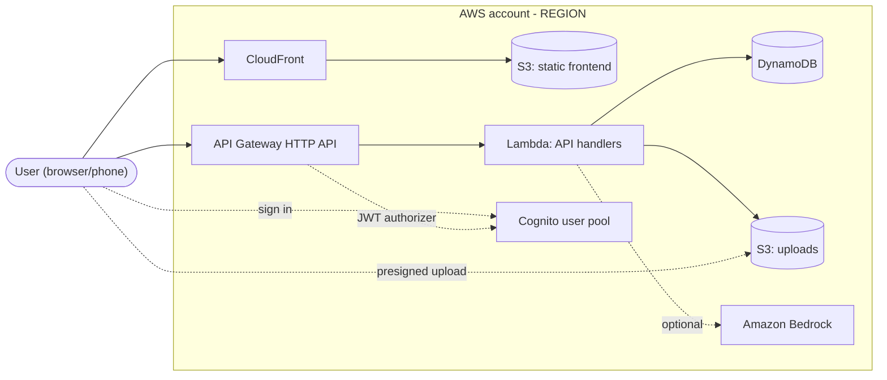
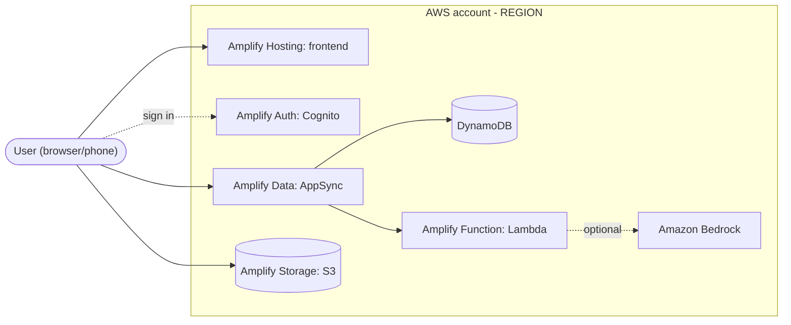
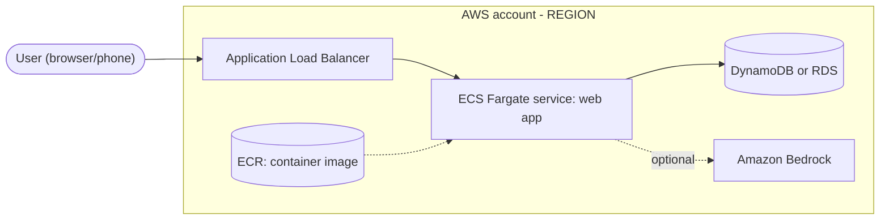

# Decision and Steering Templates

Read this file in Phase 5 of architecture-selection, after the user has approved. Copy only what you need. Replace every `<...>` placeholder, and delete lines and sections that do not apply instead of leaving placeholders behind. Mark anything the user did not state as `(assumed)`.

## 1. ADR: `docs/decisions/NNNN-<slug>.md`

````markdown
# NNNN. <Decision title>

- Status: Accepted | Proposed (pending spike) | Superseded by NNNN
- Date: YYYY-MM-DD
- Deciders: <the 3 teammates>
- Supersedes: <NNNN or none>

## Context
<Problem and user in 1-2 sentences. Demo flow. Time left. Team skills. AWS account type and
budget/credits. Event rules. Mark anything the user did not state as (assumed).>

## Decision drivers
- <e.g. working demo within N hours>
- <e.g. two members know React; one knows Python>

## Options considered
- A: <one line: services, language, IaC>
- B: <one line>
- Dropped by knock-out: <option - rule that removed it>

## Decision matrix
<table from Phase 3, with a reason for every 1 or 5>

## Decision
We will use <option> because <2-3 reasons tied to the drivers>.

## Architecture
<mermaid diagram from section 2, edited to match the decision>

## Consequences
- Positive: <...>
- Accepted trade-offs: <...>
- Follow-ups: <spike, verification, owner>

## Guardrails
Region: <code>; exceptions: <service - region - reason, or none>.
IAM: <Identity Center or per-person IAM users; per-function roles via IaC grants/policy templates>.
Secrets: <store>. Budget alert: <threshold, recipients>.
Demo fallback: <seeded data / recorded video / cached AI answer>.
Teardown: <command>, on <date>, by <owner>.

## Revisit if
- <e.g. model unavailable in region; cost alert fires; scope adds real-time>
````

When a spike passes, change only the Status line to `Accepted`. When a spike fails, write a new ADR for the runner-up that supersedes this one.

## 2. Mermaid diagrams (pick one, then edit)

Delete nodes you are not using rather than leaving them for decoration. GitHub renders mermaid blocks, so the same diagram can go into the README and the demo slides.

Option A / A-lite (serverless API). With Amplify Hosting, replace the `cdn` and `site` nodes with one `host["Amplify Hosting: frontend"]` node. For A-lite, replace `api` with `url["Lambda function URL"]` and drop Cognito.



Option B (Amplify Gen 2):



Option C (container):



## 3. `.kiro/steering/tech.md` (always-on; keep it to about 80 lines)

If the file exists, replace or append only these sections and keep teammates' content. If it has frontmatter, keep it.

```markdown
# Tech Stack

Source of truth for stack decisions. Current decision: docs/decisions/NNNN-<slug>.md
Changing a core choice (region, compute, database, auth, IaC tool, backend language) needs a new
ADR via /architecture-selection. Small additions that fit the decision: edit this file and add a
Follow-ups line to the current ADR.

## Summary
<one line, e.g. React (Vite) SPA on Amplify Hosting; API Gateway HTTP API + Lambda (Python);
DynamoDB; Cognito; IaC: AWS SAM; region ap-southeast-1>

## AWS
- Region: <code> for all resources. Exceptions: <service - region - reason, or none>
- Account: <shared / per person / event-provided, and until when>
- Services in use: <list>
- Decided against: <service - one-line reason>

## Languages and frameworks
- Frontend: <framework, language, UI library>
- Backend: <runtime, framework>
- Versions: <pin what the team actually has installed; must be a supported Lambda runtime if using Lambda>
- Package managers: <npm / pnpm / pip / uv>
- Tests: <Vitest / Jest / pytest>; AWS mocked at the SDK boundary in unit tests; property-testing
  library: <name, or none>
- GenAI (if used): Bedrock <model or inference profile ID> via the Converse API; ID read from MODEL_ID

## Build, deploy, teardown
- Personal sandbox: `<command>` (each teammate deploys their own stack or sandbox)
- Shared/demo deploy: `<command>` (owner: <name>)
- Teardown: `<command>` (owner: <name>, after judging on <date>)

## Rules for the agent
- Use only the services, frameworks and libraries listed here. Ask before adding any new one.
- Read the region and resource names from configuration or environment variables. No hard-coded
  regions, ARNs, account IDs or keys.
- Least privilege: grant each function access only to the specific resources and actions it uses,
  through IaC grant helpers or policy templates. No "*" actions.
- Never fix an AccessDenied error by widening a policy to "*". Add the exact action and resource
  named in the error.
- CORS is set in one place: <the HTTP API's CORS settings | the shared response helper (REST proxy)>.
  Allowed origin = the frontend URL from config (ALLOWED_ORIGIN); never "*" with credentials.
- Secrets live in <Parameter Store SecureString / Secrets Manager / Amplify secrets>. Never in code,
  steering, specs or chat.
- GenAI: set max tokens, handle throttling with retry and backoff, show errors to the user, keep
  personal data out of prompts and logs.
- Every resource is tagged project=<name> and named <project>-<stage>-<thing>.
- Keep diffs small; edit existing files instead of regenerating them.
```

## 4. `.kiro/steering/structure.md` (always-on; keep it to about 80 lines)

Fill the Layout from `references/repo-layouts.md` (Phase 5 tells you when to read it). Keep the `## Ownership` heading and table columns: the quick-spec skill reads that table to assign owner tags and work streams (Owner, Covers), and the bug-fix skill to assign each bug's owner and reviewer (Owner, Reviewer).

```markdown
# Project Structure

## Layout
<tree for the chosen option, trimmed to folders the project will actually use>

## Naming
- Files and folders: <kebab-case for TS/JS, snake_case for Python modules>
- Environment variables: UPPER_SNAKE (TABLE_NAME, BUCKET_NAME, MODEL_ID, ALLOWED_ORIGIN)
- AWS resources: <project>-<stage>-<thing>; stage = teammate handle or "demo"
- Branches: main is always demo-ready; feature/<short-name> for features (quick-spec adds
  -fe/-be/-infra per stream); fix/bug-<n>-<short-name> for bug fixes
- Commits: Conventional Commits (feat:, fix:, docs:, chore:); one bug per fix commit

## Ownership
| Area | Owner | Reviewer | Covers |
|---|---|---|---|
| Frontend and demo UX | <name> | <name> | <folders> |
| API and data | <name> | <name> | <folders> |
| Infra, AI and delivery | <name> | <name> | <folders>, budget alert, teardown |

## Where things go
- Handlers: <path>. Shared code: <path>. Infra: <path>. Tests: <path>.
- Decisions: docs/decisions/. Specs: .kiro/specs/<feature-name>/. Bug log: docs/BUGS.md.
- Changes to shared files (tech.md, the IaC template, the API client) are announced in team chat first.
```

## 5. `.kiro/steering/product.md` (only if missing)

Only facts the user stated. 3-6 lines. No invented features, users or metrics.

```markdown
# Product
- Problem: <one sentence from Q1>
- Users: <who>
- Demo flow: <the 1-3 actions from Q2>
- Out of scope for the event: <anything the user ruled out, or omit this line>
```

## 6. Optional: scoped infra steering (`.kiro/steering/aws-infra.md`)

Use this when the infrastructure rules would push `tech.md` past about 80 lines. With `inclusion: fileMatch`, Kiro loads the file only when matching files are in context. `fileMatchPattern` takes one glob or an array. Keep the file in the workspace `.kiro/steering/` folder: fileMatch has been reported not to trigger for global steering in `~/.kiro/steering/`.

```markdown
---
inclusion: fileMatch
fileMatchPattern: ["backend/template.yaml", "infra/**", "amplify/**"]
---

# AWS Infrastructure Rules
- <IaC conventions, default tags, log retention, removal policies, per-stage parameters>
```

Trim `fileMatchPattern` to the folders the chosen option actually has.
