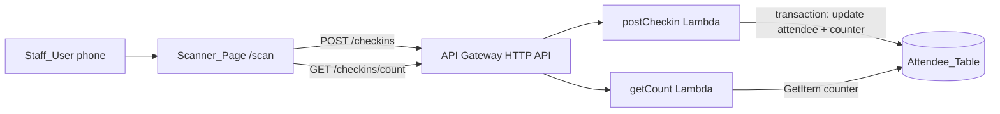

# Worked Example: attendee-checkin

This is a complete model answer for the `quick-spec` skill. It is **illustrative only**: the stack and folder names below are assumptions made for the example. In a real run, take them from `.kiro/steering/tech.md` and `.kiro/steering/structure.md`. Never copy this example's choices into a real spec without checking the steering files.

Assumed stack for this example: a React single-page app, an API Gateway HTTP API, Lambda (Node.js, TypeScript), DynamoDB, and infrastructure as code with the tool named in `tech.md`. The assumed folders are `frontend/`, `backend/`, `shared/`, `infra/`, `scripts/` and `docs/`.

## The request

```text
/quick-spec staff scan attendee QR codes at the door to check them in, show a live count
```

## Phase 1: route

- There is one role (staff), one table, two routes and about half a day of work. Nothing is broken, and every service needed is already in the assumed `tech.md`.
- Decision: quick spec.

## Phase 3: the single clarification message

```text
Quick spec for "attendee check-in by QR". I'll write the 3 files after one answer from you.
Reply "ok" to accept all defaults, or change only what's wrong:
1. QR contains only an opaque random ticket ID (no name/email)? Default: yes
2. Staff login is out of scope; the API runs in the dev stage for the demo only? Default: yes
3. Manual ticket-ID entry when the camera fails? Default: yes
4. Count refresh: polling every 15 s is enough (no WebSockets)? Default: yes
Out of scope unless you say otherwise: registration, emailing QR codes, offline queue, multi-event.
```

The teammate replies: `ok`.

## Phase 4: folder

The folder is `.kiro/specs/attendee-checkin/`. No other spec has that name.

---

## File 1: .kiro/specs/attendee-checkin/requirements.md

````markdown
# Requirements Document

## Introduction

Event staff check attendees in at the door by scanning the QR code on each attendee's ticket with a phone browser. The page shows who was checked in and a running total. At the demo, a staff member scans a printed QR code, sees a success message with the attendee's name and sees the count go up; scanning the same code again is rejected.
Stack and conventions follow `.kiro/steering/tech.md` and `.kiro/steering/structure.md`.

## Glossary

- **Staff_User**: an event volunteer at the registration desk using a phone browser.
- **Attendee**: a person registered for the event; represented by a fake record in the demo.
- **Ticket_Id**: an opaque random identifier (12-32 URL-safe characters, no `#`) encoded in the attendee's QR code; it contains no personal data.
- **Scanner_Page**: the React page at `/scan` that decodes QR codes and shows results.
- **Checkin_Api**: the API Gateway routes `POST /checkins` and `GET /checkins/count` with their Lambda functions.
- **Attendee_Table**: the DynamoDB table holding attendee records and the counter item.
- **Checkin_Counter**: the single counter item in Attendee_Table holding the number of checked-in attendees.

## Requirements

### Requirement 1: Check in an attendee by scanning a QR code

**User Story:** As a Staff_User, I want to scan an attendee's QR code, so that their arrival is recorded in seconds.

#### Acceptance Criteria

1. WHEN the Scanner_Page decodes a Ticket_Id that exists and is not checked in, THE Checkin_Api SHALL store the current time as checkedInAt and return status "checked_in" with the attendee display name.
2. WHEN the Checkin_Api returns "checked_in", THE Scanner_Page SHALL show a success state with the attendee display name.
3. IF the Ticket_Id does not exist, THEN THE Checkin_Api SHALL return HTTP 404 and SHALL NOT write any data.
4. IF the attendee is already checked in, THEN THE Checkin_Api SHALL return HTTP 409 with the original checkedInAt and SHALL NOT overwrite it.
5. WHEN the Checkin_Api returns HTTP 404, THE Scanner_Page SHALL show "Ticket not found".
6. WHEN the Checkin_Api returns HTTP 409, THE Scanner_Page SHALL show "Already checked in at <time>" using the device's local time.

### Requirement 2: Live checked-in count

**User Story:** As a Staff_User, I want to see how many attendees have arrived, so that organizers know when to start the opening session.

#### Acceptance Criteria

1. THE Scanner_Page SHALL display the number of checked-in attendees.
2. WHEN a check-in succeeds, THE Scanner_Page SHALL show the count returned by the Checkin_Api without a page reload.
3. THE Checkin_Counter SHALL equal the number of attendees that have a checkedInAt value.
4. WHILE the Scanner_Page is open, THE Scanner_Page SHALL refresh the count from the Checkin_Api every 15 seconds.

### Requirement 3: Scanner resilience

**User Story:** As a Staff_User, I want the scanner to keep working when the camera or network misbehaves, so that the queue at the door keeps moving.

#### Acceptance Criteria

1. IF camera access is denied or unavailable, THEN THE Scanner_Page SHALL show a manual Ticket_Id entry field that submits to the same Checkin_Api route.
2. IF a Checkin_Api request fails or times out, THEN THE Scanner_Page SHALL show "Network error - tap to retry" and SHALL NOT show a success state.
3. IF the decoded QR text is not a well-formed Ticket_Id, THEN THE Scanner_Page SHALL show "Not an event ticket" without calling the Checkin_Api.

### Requirement 4: Recent check-ins on this device (stretch)

**User Story:** As a Staff_User, I want to see my last few check-ins, so that I can answer "did you scan me?" quickly.

#### Acceptance Criteria

1. WHERE the recent list is enabled, THE Scanner_Page SHALL show the display names and times of the last 5 successful check-ins made on this device.

## Assumptions

- A1: The QR code encodes only the Ticket_Id; the seed script generates the Ticket_Ids and the printable QR codes.
- A2: Staff authentication is out of scope; the Checkin_Api is deployed only to the dev stage for the demo.
- A3: One event per deployment.
- A4: All attendee data in the demo is fake, created by the seed script.
- A5: The QR decoding and generation libraries are the ones recorded in `tech.md`.

## Out of Scope

- Staff login and roles
- Attendee registration and sending QR codes to attendees
- Offline queueing of check-ins
- Multiple events, analytics dashboards
````

---

## File 2: .kiro/specs/attendee-checkin/design.md

````markdown
# Design Document: Attendee Check-in

## Overview

A phone browser opens the Scanner_Page, decodes a QR code to a Ticket_Id and calls `POST /checkins`. A Lambda function records the check-in and increments the Checkin_Counter in one DynamoDB transaction, so a ticket can be checked in only once and the count always matches. The page shows the result and polls `GET /checkins/count` for check-ins made on other devices.
Relies on: `tech.md` (React, API Gateway HTTP API, Lambda Node.js/TypeScript, DynamoDB, the IaC tool) and `structure.md` (`frontend/`, `backend/`, `shared/`, `infra/`, `scripts/`).
Related specs: none.

## Architecture



### Key Design Decisions

- A conditional update (`attribute_exists(ticketId) AND attribute_not_exists(checkedInAt)`) inside a DynamoDB transaction blocks a second check-in, even when two scanners race (1.4).
- The counter item is updated in the same transaction as the attendee, so the count is a single GetItem with no Scan (2.1, 2.3).
- When the transaction is cancelled, the function reads the attendee item: no item means 404 and an existing item means 409 with the stored checkedInAt (1.3, 1.4).
- Polling every 15 seconds instead of WebSockets keeps this a quick spec. Real-time push would be a decision for architecture-selection.
- One Ticket_Id regular expression lives in the shared contract and is used by both the page (3.3) and the API (400 response).

## Components and Interfaces

| Component | Responsibility | Location | Stream |
|---|---|---|---|
| Scanner_Page | Camera decoding, manual entry, result states, count | `frontend/src/pages/ScanPage.tsx`, `frontend/src/components/scan/` | FE |
| Check-in client | Calls the API, handles timeout | `frontend/src/api/checkinClient.ts` | FE |
| postCheckin | Validate, run the transaction, map results to HTTP status | `backend/src/checkin/postCheckin.ts` | BE |
| getCount | Read the counter item | `backend/src/checkin/getCount.ts` | BE |
| Check-in repo | DynamoDB calls | `backend/src/checkin/repo.ts` | BE |
| Shared contract | Types, Ticket_Id regex, mocks | `shared/contracts/checkin.ts`, `shared/contracts/checkin.mock.ts` | BE |
| Table, routes, functions, IAM, CORS | Infrastructure as code | `infra/` (check-in module and stack entry) | INFRA |
| Seed and QR sheet | Fake attendees, counter item, printable QR codes | `scripts/seed-attendees.ts` | QA |

## Data Models

### Attendee_Table

| Attribute | Type | Notes |
|---|---|---|
| `ticketId` | string | Partition key. The Ticket_Id for attendees, or `#COUNTER` for the counter item. `#` cannot appear in a valid Ticket_Id, so the two cannot collide. |
| `displayName` | string | Attendee items only. Fake in the demo. |
| `checkedInAt` | string | ISO-8601 UTC timestamp. Absent until check-in. |
| `checkedInCount` | number | Counter item only. Starts at 0. |

Access patterns:
- AP1: check in by Ticket_Id. A transaction updates the attendee item (with the condition above) and adds 1 to `checkedInCount` on `#COUNTER`.
- AP2: read the count with GetItem `#COUNTER`.
- AP3: after a cancelled transaction, run GetItem on the Ticket_Id to choose between 404 and 409.

Example records (fake data):
`{ "ticketId": "k7Q2xV9pLm3T", "displayName": "Test Attendee 042" }`
`{ "ticketId": "#COUNTER", "checkedInCount": 0 }`

## API Contract

### POST /checkins

Auth: none (dev stage demo only; see A2). CORS allows the frontend origin from the `ALLOWED_ORIGIN` environment variable.

Request:
`{ "ticketId": "k7Q2xV9pLm3T" }`

| Status | Body | When (criterion) |
|---|---|---|
| 200 | `{ "status": "checked_in", "displayName": "Test Attendee 042", "checkedInAt": "<ISO-8601>", "count": 43 }` | 1.1, 2.2 |
| 400 | `{ "error": "invalid_ticket_id" }` | Malformed Ticket_Id (server-side check of 3.3) |
| 404 | `{ "error": "ticket_not_found" }` | 1.3 |
| 409 | `{ "status": "already_checked_in", "displayName": "Test Attendee 042", "checkedInAt": "<original ISO-8601>" }` | 1.4 |
| 500 | `{ "error": "internal" }` | Unexpected failure; details go to the logs only |

### GET /checkins/count

| Status | Body | When (criterion) |
|---|---|---|
| 200 | `{ "count": 42 }` | 2.1, 2.4 |

## Error Handling

| Scenario | Detection | Response to user | Criterion |
|---|---|---|---|
| Unknown Ticket_Id | Transaction cancelled, then GetItem finds no item | "Ticket not found" | 1.3, 1.5 |
| Already checked in | Transaction cancelled, then GetItem finds an item with checkedInAt | "Already checked in at <local time>" | 1.4, 1.6 |
| Camera denied or missing | Camera permission or device error in the browser | Manual entry field | 3.1 |
| Network failure or timeout | Client request rejects or times out | "Network error - tap to retry" | 3.2 |
| QR is not a ticket | Regex check on the page | "Not an event ticket" | 3.3 |

## AWS Notes

- IAM: postCheckin needs only the DynamoDB actions it uses (UpdateItem, GetItem) on Attendee_Table, and getCount needs only GetItem on it. Confirm in the DynamoDB IAM documentation exactly which actions a transaction requires.
- Config and secrets: the IaC sets `TABLE_NAME` and `ALLOWED_ORIGIN` on the functions. No secrets are needed.
- CORS and auth: the HTTP API allows `ALLOWED_ORIGIN` only. There is no auth, so deploy to the dev stage only (A2).
- Cost: small and request-driven. Check current pricing for the capacity mode `tech.md` chooses, and delete the dev stack after the event.
- Personal data: only `displayName`, and it is fake in the demo. No email, phone or IC number is stored.

## Testing Strategy

- Required: `backend/test/checkin/postCheckin.test.ts` checks the status mapping for 200, 400, 404 and 409 with a mocked repo (1.1, 1.3, 1.4).
- Optional: component tests for the result states; the property tests below, using the property-testing library named in `tech.md`.
- Demo path check: seed 50 fake attendees and print 3 QR codes. Scan code 1 (success, count goes up), scan code 1 again (already checked in), scan any non-ticket QR (not an event ticket), type an unknown ID (ticket not found), then switch on airplane mode and scan (network error).

## Correctness Properties

### Property 1: A ticket is checked in at most once

*For any* sequence of check-in requests for the same Ticket_Id, checkedInAt is set exactly once and never changes afterwards.

**Validates: Requirements 1.4**

### Property 2: The counter matches the data

*For any* set of check-in requests, Checkin_Counter equals the number of attendee items that have checkedInAt.

**Validates: Requirements 2.3**
````

---

## File 3: .kiro/specs/attendee-checkin/tasks.md

````markdown
# Implementation Plan: Attendee Check-in

## Overview

Agree on the contract first (task 1.1). Then the three streams run in parallel: the frontend works against mocks while the backend and infrastructure are built. The integration checkpoint switches the page to the deployed dev API and runs the demo path.

| Stream | Owner | Folders owned | Est. |
|---|---|---|---|
| FE | @A | `frontend/` | 3h (+45m optional) |
| BE | @B | `backend/src/checkin/`, `backend/test/checkin/postCheckin.test.ts`, `shared/contracts/` | 2.75h |
| INFRA/QA | @C | `infra/`, `scripts/`, `docs/demo/`, `backend/test/checkin/checkin.property.test.ts` | 2.75h (+1h optional) |

Shared hot files and their single owner: `frontend/package.json` and the frontend router go to @A; `backend/package.json` goes to @B; the infra stack entry goes to @C.

## Tasks

- [ ] 1. Shared contract
  - [ ] 1.1 Define the check-in contract, Ticket_Id regex and mocks
    - Owner: @B | Stream: BE | Est: 45m | Depends on: none
    - Files: shared/contracts/checkin.ts, shared/contracts/checkin.mock.ts
    - Done when: types compile, and mocks exist for 200, 400, 404, 409 and a network error
    - _Requirements: 1.1, 1.3, 1.4, 2.1, 3.3_

- [ ] 2. Checkpoint - Contract agreed
  - All three review task 1.1 for 10 minutes. Ensure all tests pass, ask the user if questions arise.

- [ ] 3. Frontend stream
  - [ ] 3.1 Build the scanner page with camera decoding and manual-entry fallback (against mocks)
    - Owner: @A | Stream: FE | Est: 1.5h | Depends on: 1.1
    - Files: frontend/src/pages/ScanPage.tsx, frontend/src/components/scan/CameraScanner.tsx, frontend/src/components/scan/ManualEntry.tsx, frontend router (one line)
    - Done when: decoding a printed test QR calls the mock client with its Ticket_Id; denying camera permission shows manual entry; a non-ticket QR shows "Not an event ticket"
    - _Requirements: 3.1, 3.3_
  - [ ] 3.2 Add the result states, live count and API client
    - Owner: @A | Stream: FE | Est: 1.5h | Depends on: 3.1
    - Files: frontend/src/components/scan/ScanResult.tsx, frontend/src/components/scan/CheckinCount.tsx, frontend/src/api/checkinClient.ts
    - Done when: each mock status shows the right message, the count updates on success, and polling runs every 15 seconds
    - _Requirements: 1.2, 1.5, 1.6, 2.1, 2.2, 2.4, 3.2_
  - [ ]* 3.3 Component tests for the result states
    - Owner: @A | Stream: FE | Est: 45m | Depends on: 3.2
    - Files: frontend/src/components/scan/ScanResult.test.tsx
    - _Requirements: 1.5, 1.6, 3.2_

- [ ] 4. Backend stream
  - [ ] 4.1 Implement the POST /checkins handler with a transactional conditional write
    - Owner: @B | Stream: BE | Est: 1.5h | Depends on: 1.1
    - Files: backend/src/checkin/postCheckin.ts, backend/src/checkin/repo.ts, backend/test/checkin/postCheckin.test.ts
    - Done when: the required unit test for the 200/400/404/409 mapping passes
    - _Requirements: 1.1, 1.3, 1.4, 2.3_
  - [ ] 4.2 Implement the GET /checkins/count handler
    - Owner: @B | Stream: BE | Est: 30m | Depends on: 4.1
    - Files: backend/src/checkin/getCount.ts
    - Done when: it returns `{ "count": n }` from the counter item in a local or unit test
    - _Requirements: 2.1, 2.4_

- [ ] 5. Infrastructure, data and QA stream
  - [ ] 5.1 Define the table, two routes, functions, IAM and CORS in IaC
    - Owner: @C | Stream: INFRA | Est: 1.5h | Depends on: 1.1
    - Files: infra/ check-in module, infra stack entry
    - Done when: the stack is deployed to the dev stage and both routes respond (stub handlers are fine until 4.x is merged)
    - _Requirements: 1.1, 2.1_
  - [ ] 5.2 Write the seed script for fake attendees, the counter item and a printable QR sheet
    - Owner: @C | Stream: QA | Est: 1h | Depends on: 5.1
    - Files: scripts/seed-attendees.ts
    - Done when: one run creates 50 fake attendees and a counter set to 0, and outputs a printable page of QR codes
    - _Requirements: 1.1, 2.3_
  - [ ] 5.3 Write the demo script
    - Owner: @C | Stream: QA | Est: 15m | Depends on: 5.2
    - Files: docs/demo/attendee-checkin.md
    - Done when: it lists the exact demo path from design.md, including the error paths
    - _Requirements: 1.2, 1.4, 3.2_
  - [ ]* 5.4 Property tests: one check-in per ticket, and the counter matches the data
    - Owner: @C | Stream: QA | Est: 1h | Depends on: 4.1
    - Files: backend/test/checkin/checkin.property.test.ts
    - **Property 1: A ticket is checked in at most once**
    - **Property 2: The counter matches the data**
    - _Requirements: 1.4, 2.3_

- [ ] 6. Checkpoint - Integration
  - Merge in the order 5.1, then 4.x, then 3.x. Set the frontend API base URL to the dev stage and run docs/demo/attendee-checkin.md end to end, including one error path. Ensure all tests pass, ask the user if questions arise.

- [ ]* 7. Stretch
  - [ ]* 7.1 Show the recent check-ins list on this device
    - Owner: @A | Stream: FE | Est: 45m | Depends on: 6
    - Files: frontend/src/components/scan/RecentCheckins.tsx
    - _Requirements: 4.1_

- [ ] 8. Checkpoint - Final
  - Run the demo path on the dev stage once more, add a line to the README on how to open /scan, and list the AWS resources to delete after the event. Ensure all tests pass, ask the user if questions arise.

## Notes

- Tasks marked with `*` are optional and can be skipped for a faster MVP.
- Each task references specific requirements for traceability.
- Checkpoints ensure incremental validation; cross-stream dependencies happen only at checkpoints.
- Start tasks one at a time in priority order; on the Free plan avoid "Run all tasks" unless enough credits remain.
- A teammate may implement a task by hand and tick its box; that uses no credits.
- Branches: `feat/attendee-checkin-fe`, `feat/attendee-checkin-be`, `feat/attendee-checkin-infra`; merge task 1.1 first.
````

---

## Self-check result for this example

- Every criterion is covered by a non-optional task: 1.1 (1.1, 4.1, 5.1, 5.2), 1.2 (3.2), 1.3 (4.1), 1.4 (4.1), 1.5 (3.2), 1.6 (3.2), 2.1 (3.2, 4.2, 5.1), 2.2 (3.2), 2.3 (4.1, 5.2), 2.4 (3.2, 4.2), 3.1 (3.1), 3.2 (3.2), 3.3 (3.1). Only 4.1, the stretch goal, is optional.
- There are 11 leaf tasks (3 of them optional), all 2 hours or less, with no file shared between parallel tasks. The required-work estimates are FE 3h, BE 2.75h and INFRA/QA 2.75h.
- No service outside the assumed `tech.md` is used, and no real personal data appears.

## Chat summary sent back

```text
Quick spec ready: .kiro/specs/attendee-checkin/
- 4 requirements, 14 criteria, 11 tasks (3 optional), 3 checkpoints
- Assumptions: A1 QR holds only ticket ID; A2 no staff login, dev stage only  (reply to change; I'll edit only those lines)
- Streams: @A FE 3h | @B BE 2.75h | @C INFRA/QA 2.75h  -> critical path about 4h (contract, then FE)
- Start: task 1.1 (@B), then each owner starts their stream after Checkpoint 2
- In Kiro: Specs section -> attendee-checkin -> tasks.md -> Start task on your next task
```
