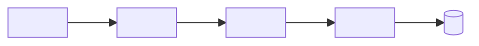

# Quick Spec Templates

These are copy-paste skeletons for the three files in `.kiro/specs/<feature-name>/`. Replace every `<...>` placeholder, and delete any optional section that would say nothing. The headings follow the layout Kiro's own spec flow generates, so keep them as they are.

Length targets: `requirements.md` about 80 lines or fewer, `design.md` about 120 or fewer, `tasks.md` about 100 or fewer.

---

## requirements.md

````markdown
# Requirements Document

## Introduction

<2-4 sentences: what is being built, for which user, and what must work at the demo.>
Stack and conventions follow `.kiro/steering/tech.md` and `.kiro/steering/structure.md`.

## Glossary

- **<Actor_Name>**: <who this person is, e.g. "event staff member at the registration desk">
- **<Component_Name>**: <what it is and where it runs, e.g. "React page at /scan">
- **<Data_Term>**: <definition, e.g. "opaque random identifier printed as a QR code; contains no personal data">

## Requirements

### Requirement 1: <Demo moment title>

**User Story:** As a <Actor_Name>, I want <capability>, so that <benefit>.

#### Acceptance Criteria

1. WHEN <trigger>, THE <Component_Name> SHALL <observable response>.
2. WHEN <trigger>, THE <Component_Name> SHALL <observable response>.
3. IF <invalid input or failure>, THEN THE <Component_Name> SHALL <observable response>.

### Requirement 2: <Title>

**User Story:** As a <Actor_Name>, I want <capability>, so that <benefit>.

#### Acceptance Criteria

1. THE <Component_Name> SHALL <always-true rule>.
2. WHILE <state>, THE <Component_Name> SHALL <response>.
3. IF <failure>, THEN THE <Component_Name> SHALL <response>.

### Requirement N: <Stretch goal title> (stretch)

**User Story:** As a <Actor_Name>, I want <capability>, so that <benefit>.

#### Acceptance Criteria

1. WHERE <option is enabled>, THE <Component_Name> SHALL <response>.

## Assumptions

- A1: <assumption the teammate accepted by default>
- A2: <...>

## Out of Scope

- <thing deliberately not built in this spec>
- <...>
````

---

## design.md

````markdown
# Design Document: <Feature Title>

## Overview

<3-6 lines: how the feature works end to end.>
Relies on: `tech.md` (<services/languages used>), `structure.md` (<folders used>).
Related specs: <none | .kiro/specs/<other-feature>/>

## Architecture



### Key Design Decisions

- <Decision> - <one-line reason>.
- <Decision> - <one-line reason>.

## Components and Interfaces

| Component | Responsibility | Location | Stream |
|---|---|---|---|
| <Component_Name> | <one line> | `<path from structure.md>` | FE |
| <Component_Name> | <one line> | `<path>` | BE |
| <Component_Name> | <one line> | `<path>` | INFRA |

## Data Models

### <TableOrEntityName>

| Attribute | Type | Notes |
|---|---|---|
| `<pk>` | string | Partition key. <why this key> |
| `<attr>` | string | <optional/required, format> |

Access patterns:
- <AP1: get X by Y> -> <GetItem on pk>
- <AP2: ...> -> <...>

Example record (fake data):
`{ "<pk>": "<example>", "<attr>": "<example>" }`

## API Contract

### <METHOD> <path>

Auth: <mode from tech.md | none (dev stage demo only; see Out of Scope)>

Request:
`{ "<field>": "<type/example>" }`

Responses:
| Status | Body | When (criterion) |
|---|---|---|
| 200 | `{ "status": "<...>", ... }` | <1.1> |
| 400 | `{ "error": "<code>" }` | <malformed input> |
| 404 | `{ "error": "<code>" }` | <1.3> |

## Error Handling

| Scenario | Detection | Response to user | Criterion |
|---|---|---|---|
| <invalid input> | <validation in handler> | <message/state> | <1.3> |
| <network failure> | <fetch rejects / timeout> | <retry option> | <3.2> |

## AWS Notes

- IAM: <function> -> <actions> on <one resource>.
- Config/secrets: <env vars and where they come from; no secrets in code>.
- CORS/auth: <...>.
- Cost: <anything continuous or large; "check current pricing">.
- Personal data: <what is stored and why | none>.

## Testing Strategy

- Required: <the one or two tests that protect the core rule, with file path>.
- Optional (`*` tasks): <other unit/component tests>.
- Demo path check: <the exact click or curl sequence used at the integration checkpoint>.

## Correctness Properties (optional - only for pure logic worth property testing)

### Property 1: <title>

*For any* <input class>, <property that must hold>.

**Validates: Requirements <x.y>**
````

### AWS design checklist (for the `## AWS Notes` section)

Write one line per item that applies, or "n/a". Use only facts from `tech.md` or the teammate; do not add quotas, prices or region codes from memory.

- **Services:** use only those in `tech.md`. Anything new means stopping and handing off to `architecture-selection`.
- **IAM:** give each Lambda function or role least-privilege access, naming the actions and the one resource it touches (for example `dynamodb:UpdateItem` on the `Attendees` table). Where unsure which actions an API call needs, write "confirm in the service's IAM documentation".
- **Config and secrets:** keep no keys, passwords or account IDs in code or the spec. Use environment variables, filled from SSM Parameter Store or Secrets Manager as `tech.md` prescribes.
- **API Gateway:** set CORS when the frontend is served from another origin. State the auth mode, or list auth explicitly under Out of Scope (and say the API is deployed to a dev stage only).
- **DynamoDB:** derive the keys from the listed access patterns. Use conditional writes (or a transaction) for "only once" rules. Never put a Scan on the request hot path.
- **S3:** keep buckets private. Use presigned URLs for browser upload and download.
- **Bedrock (if used):** model access must be enabled for the account, and model availability differs by region, so check before relying on a model. Keep prompts in a versioned file, and write an `IF ..., THEN` criterion for throttling or model errors.
- **Region and naming:** follow `tech.md`. Do not hardcode a region in application code; read it from configuration.
- **Cost:** name anything that runs continuously or stores large files, and add "check current pricing". Do not put cost estimates in the spec. List resources to delete after the event.
- **Personal data:** store the minimum and say what is stored and why. If names, emails, phone numbers or IC numbers are kept, note that consent may be needed (Malaysia has a Personal Data Protection Act) and check with the organizers. Never use an IC number as an identifier. Use fake data in mocks and seed scripts.

---

## tasks.md

````markdown
# Implementation Plan: <Feature Title>

## Overview

<1-3 lines: build order. Contract first, then three parallel streams, then integration.>

| Stream | Owner | Folders owned | Est. |
|---|---|---|---|
| FE | @A | `<frontend path>` | <h>h |
| BE | @B | `<backend path>`, `<shared contract path>` | <h>h |
| INFRA/QA | @C | `<infra path>`, `<scripts path>`, `<integration test path>` | <h>h |

Shared hot files and their single owner: `<package manifest>` -> <owner>, `<IaC stack entry>` -> @C, `<route table>` -> <owner>.

## Tasks

- [ ] 1. Shared contract
  - [ ] 1.1 Define request/response types, example payloads and mock data
    - Owner: @B | Stream: BE | Est: 45m | Depends on: none
    - Files: <shared/contracts/feature.ts>, <shared/contracts/feature.mock.ts>
    - Done when: types compile and mocks cover every status in the API Contract
    - _Requirements: <1.1, 1.3>_

- [ ] 2. Checkpoint - Contract agreed
  - All three review task 1.1 for 10 minutes. Ensure all tests pass, ask the user if questions arise.

- [ ] 3. Frontend stream
  - [ ] 3.1 <Build page/component against mocks>
    - Owner: @A | Stream: FE | Est: <1-2h> | Depends on: 1.1
    - Files: <paths>
    - Done when: <observable check>
    - _Requirements: <x.y>_
  - [ ] 3.2 <Error/empty/loading states>
    - Owner: @A | Stream: FE | Est: <h> | Depends on: 3.1
    - Files: <paths>
    - Done when: <each error state can be triggered with mocks>
    - _Requirements: <x.y>_

- [ ] 4. Backend stream
  - [ ] 4.1 <Handler + business rule>
    - Owner: @B | Stream: BE | Est: <h> | Depends on: 1.1
    - Files: <paths>
    - Done when: <required unit test passes>
    - _Requirements: <x.y>_
  - [ ]* 4.2 <Extra unit tests>
    - Owner: @B | Stream: BE | Est: <h> | Depends on: 4.1
    - Files: <test paths>
    - _Requirements: <x.y>_

- [ ] 5. Infrastructure, data and QA stream
  - [ ] 5.1 <Table/bucket, routes, IAM in IaC>
    - Owner: @C | Stream: INFRA | Est: <h> | Depends on: 1.1
    - Files: <infra paths>
    - Done when: <deployed to dev stage; route returns mock or real response>
    - _Requirements: <x.y>_
  - [ ] 5.2 <Seed script with fake data + demo script>
    - Owner: @C | Stream: QA | Est: <h> | Depends on: 5.1
    - Files: <scripts paths>, <docs/demo path>
    - Done when: <seed runs; demo script lists exact steps>
    - _Requirements: <x.y>_

- [ ] 6. Checkpoint - Integration
  - Point the frontend at the deployed dev API instead of mocks, run the demo path from the demo script, and trigger one error path. Ensure all tests pass, ask the user if questions arise.

- [ ]* 7. Stretch
  - [ ]* 7.1 <Stretch task>
    - Owner: <@X> | Stream: <..> | Est: <h> | Depends on: 6
    - _Requirements: <N.1>_

- [ ] 8. Checkpoint - Final
  - Run the demo path on the deployed environment once more, update README/demo notes, and list the AWS resources to clean up. Ensure all tests pass, ask the user if questions arise.

## Notes

- Tasks marked with `*` are optional and can be skipped for a faster MVP.
- Each task references specific requirements for traceability.
- Checkpoints ensure incremental validation; cross-stream dependencies happen only at checkpoints.
- Start tasks one at a time in priority order; on the Free plan avoid "Run all tasks" unless enough credits remain.
- A teammate may implement a task by hand and tick its box; that uses no credits.
- Branches: `feat/<feature-name>-fe`, `feat/<feature-name>-be`, `feat/<feature-name>-infra`; merge task 1.1 first.
````

The outer four-backtick fences only wrap the templates in this file. Do not copy them into the spec files. The Mermaid block in `design.md` is a normal three-backtick fenced block.
