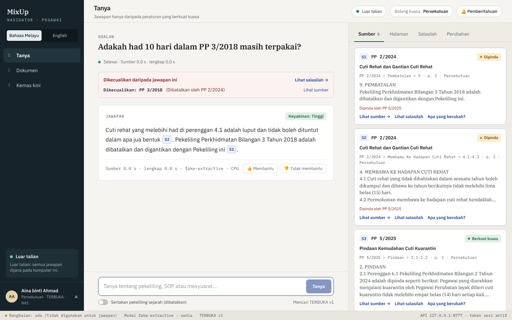
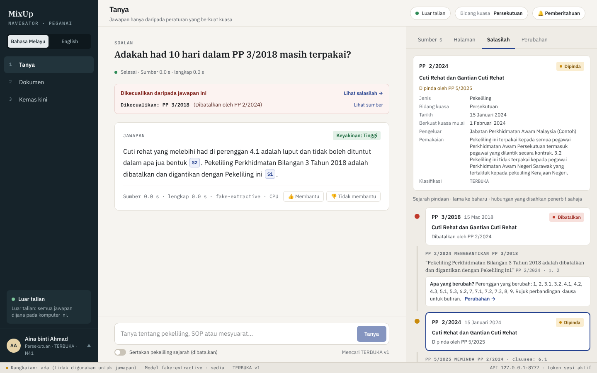
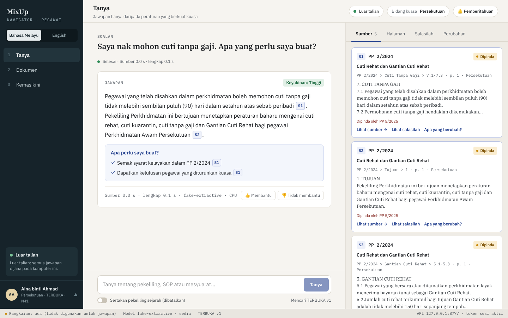
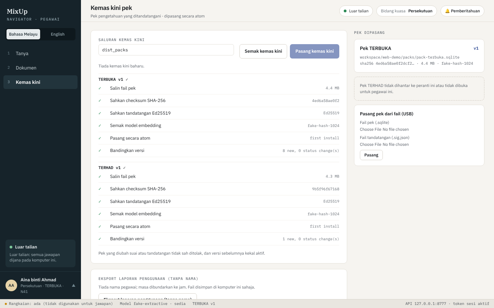
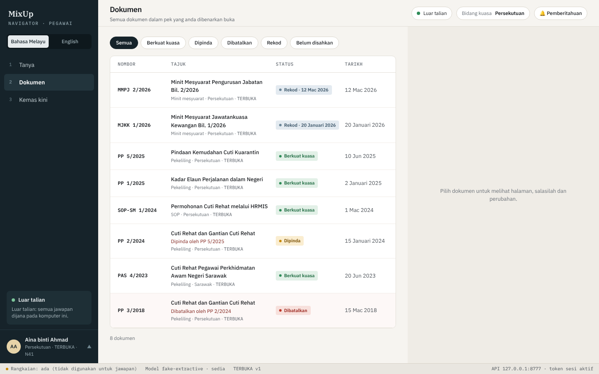
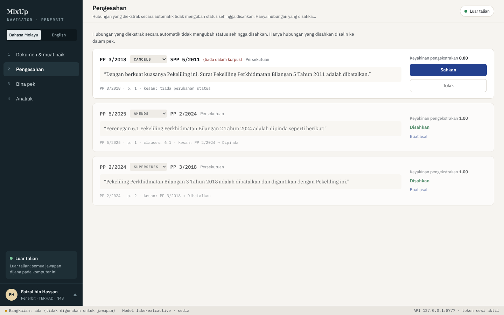
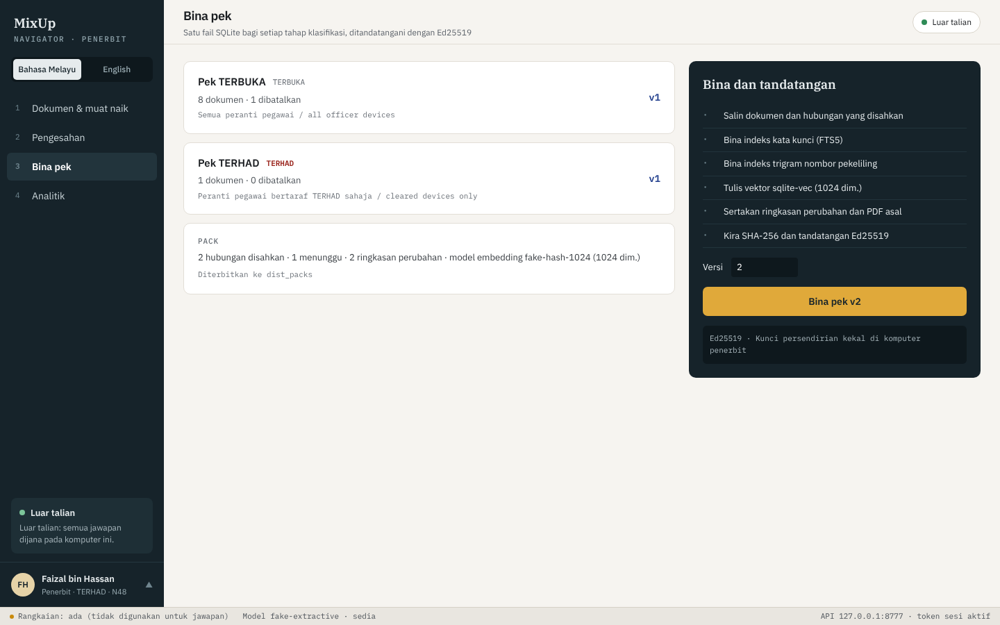
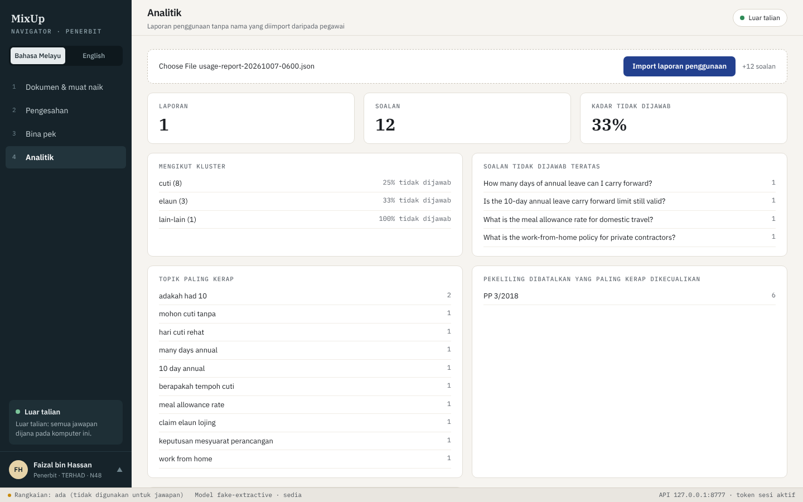

# MixUp Navigator

**Group 11 - AWS Kuching Community Day**

| Ask: cited answer, cancelled circular excluded | Lineage: what replaced what |
| --- | --- |
|  |  |
| **"Apa perlu saya buat?" action checklist** | **Signed pack update: SHA-256 + Ed25519 checked before install** |
|  |  |
| **Documents: status of every circular** | **Publisher: verify relations before they go into a pack** |
|  |  |
| **Publisher: build signed packs per clearance tier** | **Publisher: anonymised usage analytics** |
|  |  |

Offline, bilingual (Bahasa Melayu / English), validity-aware policy assistant for Malaysian civil servants,
delivered as a desktop app. It answers only from rules that are **currently in force** (plus dated meeting
records), cites the exact document, clause and page, explains which circulars were cancelled and by what,
picks the right Federal or Sarawak rule, and turns answers into action with an **"Apa perlu saya buat?"** box.
Everything runs on the officer's computer.

> Hackathon prototype. All sample documents are **synthetic** and watermarked "SINTETIK - CONTOH SAHAJA".

One codebase, two modes:

| Mode | Who | What |
| --- | --- | --- |
| **Publisher** | Knowledge administrator at head office | Upload PDFs, OCR, metadata, relation verification queue, status engine, change summaries, build **signed** knowledge packs (one SQLite file per clearance tier), usage dashboard |
| **Officer** | Every officer's PC | Install packs (verified), ask questions fully offline, sources first then streamed cited answer, lineage, what-changed, notifications |

## Quick start: website mode (live demo)

```bash
.venv/Scripts/python -m app.web
```

Or double-click `start_web.cmd`. This starts **one website** on http://127.0.0.1:8765 and opens it in the
browser. The account switcher (bottom left) decides the view: officer accounts (Aina, Jason, Aminah) see
the Officer screens, Faizal (Publisher) sees the Publisher screens; Publisher actions are refused for
officer accounts. If Ollama is not running, the fake backend is used automatically. Keep the console
window open during the demo.

## Hosted demo on Vercel (synthetic documents)

The repo deploys to Vercel as-is: `pyproject.toml` points Vercel at `app/vercel_entry.py`, which on a cold
start creates a throw-away key pair, ingests `data/raw` with the fake backend, builds and installs pack v1
under `/tmp`, and serves the website (UI from the committed `ui/dist`). Hosted mode (`PN_PUBLIC_DEMO=1`)
switches off the session token and Host check, so **use it only with the synthetic documents**. State lives
in `/tmp` and resets whenever Vercel starts a new instance. After changing the UI, run `npm run build` in
`ui/` and commit `ui/dist`.

## Requirements

* Windows 10/11 (macOS/Linux work for development).
* **Python 3.11 from python.org** (its SQLite can load extensions such as sqlite-vec).
* **Node.js 20+** only to build the UI (not needed at runtime).
* **Ollama** with `qwen3:4b` and `bge-m3` for real answers (`ollama pull qwen3:4b`, `ollama pull bge-m3`).
  About 4 GB of models; 8 GB RAM minimum, 16 GB recommended; no GPU needed.
* Optional: Tesseract 5 with Malay + English data (Publisher OCR of scanned pages); optional reranker
  `pip install -r requirements-rerank.txt` (downloads ~2.3 GB on first use, then works offline).

Without Ollama you can still run everything with `INFERENCE_BACKEND=fake` (deterministic test backend:
hash embeddings and extractive answers, labelled "fake-extractive" in the UI).

## Setup

```bash
py -3.11 -m venv .venv
.venv/Scripts/pip install -r requirements-dev.txt
cd ui && npm install && npm run build && cd ..
copy .env.example .env        # then edit INFERENCE_BACKEND / models if needed
```

## Publisher: build the knowledge packs

```bash
.venv/Scripts/python scripts/make_synthetic_docs.py     # only if data/raw is empty (already committed)
.venv/Scripts/python scripts/make_keys.py               # once: Ed25519 key pair
.venv/Scripts/python scripts/ingest_folder.py data/raw  # parse, OCR, metadata, chunks, embeddings, relations
.venv/Scripts/python scripts/build_pack.py --version 1  # -> dist_packs/pack-terbuka-v1.sqlite, pack-terhad-v1.sqlite, manifest.json
```

Or use the Publisher window: `.venv/Scripts/python -m app.desktop --mode publisher`.

The embedding model used by the Publisher and the Officer app **must be the same** (rule 8): packs built
with `INFERENCE_BACKEND=fake` only work in a fake-backend Officer app, and packs built with `bge-m3` only in
an Ollama/llama.cpp one. Rebuild the packs after switching.

## Officer: run the desktop app

```bash
.venv/Scripts/python -m app.desktop            # Officer window (pywebview)
.venv/Scripts/python -m app.desktop --browser  # dev: serve on 127.0.0.1 and print the URL with its token
```

On first run the app shows a setup screen: click **Semak kemas kini** (the default update source is
`dist_packs/`) or **Pasang pek dari fail** (pack `.sqlite` + its `.sig.json`, the USB case).

## Tests and evaluation

```bash
.venv/Scripts/python -m pytest -q               # fake backend, no model or network needed
.venv/Scripts/python scripts/evaluate.py        # golden set: baseline vs Navigator -> eval/results/
```

## Packaging (Windows)

```bash
.venv/Scripts/python scripts/package_windows.py # PyInstaller one-folder build + smoke test
```

Produces `dist/PekelilingNavigator/PekelilingNavigator.exe` (about 110 MB). Models are not bundled:
install Ollama on the target PC, or (stretch) use `INFERENCE_BACKEND=llamacpp` with `llama-server.exe`
and GGUF files in `models/` next to the executable.

## Security model

* The local API binds to **127.0.0.1 only**, on a random free port, and every `/api` request needs the
  random **session token** generated at start-up (passed to the window once, kept in memory). The Host
  header must be 127.0.0.1/localhost; no CORS.
* **Officer mode works with the network disabled.** The only other network access is the update source,
  and only when the officer checks for updates. No telemetry: query logs stay in the local `app.db`; the
  usage report is exported only on request and is anonymised (no names, times rounded to the hour).
* **Access control is enforced in code and SQL, never by the LLM.** A TERBUKA officer's session never
  opens the TERHAD pack, and every query inside a pack also filters `classification_level <= clearance`.
  **In production, restricted packs are delivered only to cleared officers' devices and stored encrypted.**
* **Packs are verified before installation**: SHA-256 checksum and an Ed25519 signature checked against the
  publisher public key bundled with the app. A failing pack is rejected and the previous version stays
  active. The publisher private key never leaves the Publisher machine (`workspace/keys/`, gitignored).
* Document text is treated as untrusted data; the answer prompt tells the model to ignore instructions
  inside passages, and every citation is validated in code (invalid ones are removed; if none remain, the
  app refuses).

## Project layout

See `SPEC.md` (specification), `TASKS.md` (milestones), `DECISIONS.md` (design choices), `PROGRESS.md`
(log) and `CLAUDE.md` (conventions). Code: `app/` (FastAPI + services), `ui/` (React), `scripts/`,
`tests/`, `data/` (synthetic corpus and ground truth), `packaging/`.

## Demo script

See the "Demo script" section at the end of `PROGRESS.md` once M9 is complete.
